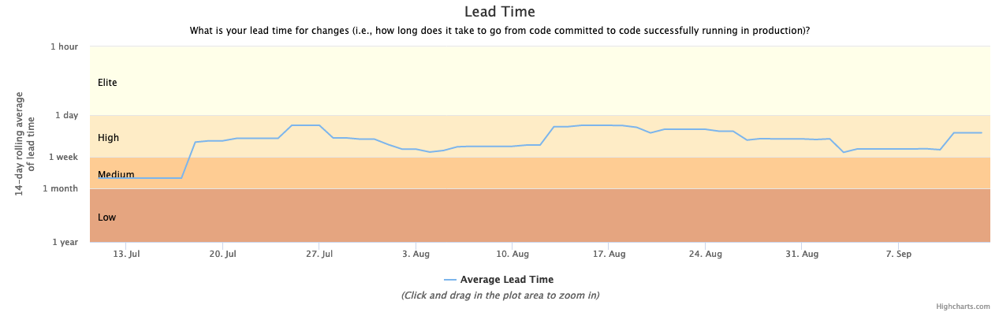
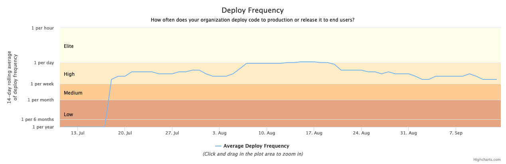

# accelerate-metrics

A tool to calculate [DevOps Research & Assessment](https://www.devops-research.com/research.html) (DORA) metrics from project data. It currently supports Heroku releases and git commits.

The metrics are based on the [Accelerate](https://itrevolution.com/book/accelerate/) book by Nicole Forsgren, Jez Humble, and Gene Kim. The authors formed the DORA program, which is now a part of Google Cloud. They used behavioral science to identify the most effective and efficient ways to develop and deliver software. Over the last six years, they have developed and validated metrics that provide a high-level systems view of software delivery and performance and predict an organization's ability to achieve its goals.

Each year they publish a report based on data from 30k+ survey participants. Organizations are categorized into Elite, High, Medium, and Low performers.

For the current report, download: https://cloud.google.com/devops/state-of-devops/

## Key Metrics

The four key metrics are:

- **lead time**: For the primary application or service you work on, what is your lead time for changes (i.e., how long does it take to go from code committed to code successfully running in production)?
- **deployment frequency**: For the primary application or service you work on, how often does your organization deploy code to production or release it to end users?
- **mean time to restore**: For the primary application or service you work on, how long does it generally take to restore service when a service incident or a defect that impacts users occurs (e.g., unplanned outage or service impairment)?
- **change fail percentage**: For the primary application or service you work on, what percentage of changes to production or released to users result in degraded service (e.g., lead to service impairment or service outage) and subsequently require remediation (e.g., require a hotfix, rollback, fix forward, patch)?

In 2019, they added a 5th metric, **availability**. It varies from team-to-team, so the DORA report does not have a single definition for it.

## Usage

Prerequisites:

- node.js > 14.4
- git for source code version management
- heroku for deployment
- `cp .env.example .env` and fill in your environment variables

To generate the report:

- `npm run generate`

To run the tests:

- `npm test`

## Motivation

One challenge with the DORA data is that it is gathered via a survey of people. Responding to the survey questions requires the participant to make a judgement call about where they think their team falls on each of the metrics and to do it at a particular point in time. This has the potential for inaccuracy because software projects can vary over time.

In 2019, [Red Gate Software](https://www.red-gate.com/), a UK-based DevOps software provider, released their [code](https://github.com/red-gate/RedGate.Metrics) for generating the four key metrics based on data in a git repository. This release, along with their [overview](https://medium.com/ingeniouslysimple/forget-dumb-productivity-measures-focus-on-software-delivery-performance-with-the-four-key-3ad0e045e5b8) and [explanation](https://medium.com/ingeniouslysimple/learning-from-the-accelerate-four-key-metrics-91725675e30a) of how they use it, is a great service to the community, as it makes the automated calculation of metrics much easier and thus more likely to be used. Their approach is tightly coupled to the use of annotated tags in git to mark releases and production issues.

For applications that use other release strategies, such as the Heroku platform, this coupling is less than ideal. Heroku uses a "push to deploy" model and, as a result, most teams using Heroku do not create git tags for each release. Heroku's [pipeline promotion feature](https://devcenter.heroku.com/articles/pipelines#promoting) further complicates the picture since a particular commit can be promoted from one environment stage in a pipeline to a downstream stage, so the time a commit is pushed to Heroku will not usually match the time when that commit is finally deployed to the production environment. On the other hand, Heroku maintains a comprehensive history of release information, which can be used in place of annotated git tags.

The goal of this project is to provide an easy way to generate the four key metrics from a variety of data sources.

## Calculation Details

All calculations are done using an X-day rolling average over a period of time, with X usually being 14 or 30 days in order to smooth out normal and acceptable sources of variation. For example, most engineering organizations do not work on weekends and so it is unusual to deploy on weekends. As a result, a rolling average window that's too short would show a high amount of volatility and the noise could potentially hide trends in the data.

### Lead Time

- Get the list of all deployments in the form of a git SHA and a deploy date for each
- For each X-day window, find all the deployments that fall within that window
- For each of those deployments, get all of the non-merge commits included in the deployment
- Calculate the lead time for each commit as the difference between the time the commit was created and the time it was deployed
- Calculate the mean lead time of all the commits for all the deploys in the window
- Perform this calculation for each day in the reporting period (looking back over the previous X-days) to get the data

The Lead Time chart plots the average lead time using a log scale on the y-axis in order to handle the large amount of variation that could occur. The performance bands (Elite, High, etc.) are based on the ranges in the 2019 DORA report.

### Deployment Frequency

- Get the list of all deployments in the form of a git SHA and a deploy date for each
- For each X-day window, find all the deployments that fall within that window
- Calculate the "best" mean frequency of those deployments by:
  - Take the X-day window and split it up into six sets of bins by: hour, day, week, month, 6 months, and 1 year
  - Assign the deployments to each set of bins based on the deploy timestamp
  - Then find the mean of the counts per bin for each set
  - Pick the "best" mean by finding the smallest mean that is >= 1
  - For example, if there was a deploy every day of the week for 14 days and we were looking at a 14-day window, the "best" mean frequency would be 1 per day instead of 7 per week or 14 per month
  - Convert the "best" mean frequency to Hertz so that all data points use the same units
- Perform this calculation for each day in the reporting period (looking back over the previous X-days) to get the data

The Deployment Frequency chart plots the average deployment frequency using a log scale on the y-axis in order to handle the large amount of variation that could occur. The performance bands (Elite, High, etc.) are based on the ranges in the 2019 DORA report.

### Change Fail Percentage

Coming Soon

### Mean Time to Restore (MTTR)

Coming Soon

### Other Considerations for Stability Metrics

The one murky area remaining related to stability is the release or situation that causes degraded stability for end-users but is fixed either by a new release or a configuration change. For example, the Redis AddOn runs out of space or connections and users are unable to log in until the service configuration has been manually updated. This ties into the Availability metric referenced in the 2019 version of the DevOps Report. Ideally, it would also add to MTTR metric.

The challenge is that "degraded service" will likely mean different things for different applications. Monitoring services such as New Relic allow thresholds to be configured. Heroku offers similar functionality for professional dynos but does not expose it via their public API. This data could be used to inform the MTTR metric. In the future, this project will look at integrating that availability and alerting data into the metrics. For now, it is out of scope.

## Acknowledgements

- Thank you to [Red Gate Software](https://www.red-gate.com/) for open sourcing their metrics code. The code in this project is greatly inspired by their approach.
- Thank you to [Def Method](https://defmethod.io) for supporting my work on this project.

## Similar Projects

- https://github.com/red-gate/RedGate.Metrics
- https://github.com/stelligent/pipeline-dashboard
- https://www.cloudbees.com/products/devoptics/overview
- https://github.com/GoogleCloudPlatform/fourkeys
- https://gitlab.com/gitlab-org/gitlab/-/issues/37139

## TODO List

- [ ] Capture degraded service events from GitHub issues
- [ ] MTTR graph
- [ ] Change/Fail graph
- [ ] better error handling/messages if a commit doesn't exist in the git history
- [ ] convert to a github action so that the report can be generated regularly
- [ ] Capture degraded service events from Heroku rollbacks
- [ ] Capture degraded service events from Sentry API

Possible new features:

- [ ] show releases per day as a histogram on the Deploy Frequency chart
- [ ] show lead times per release on the Lead Time chart
